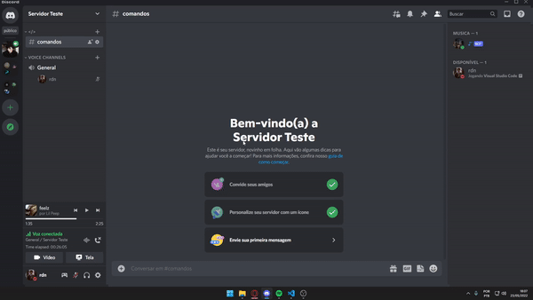
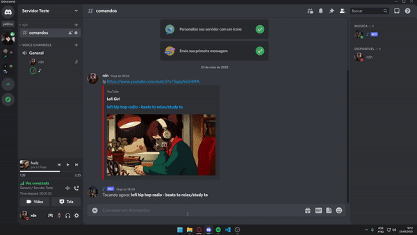
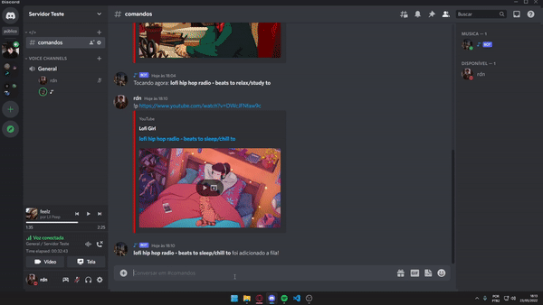
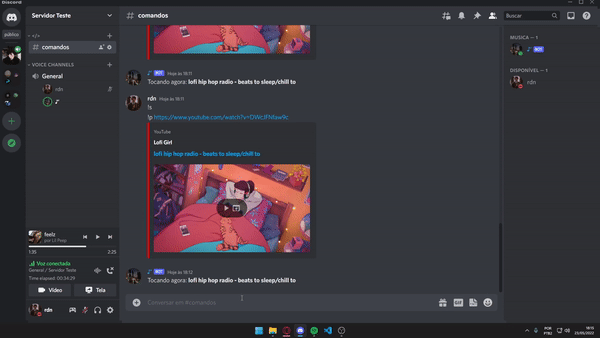

# Discord.js BOT de Música
Simples bot desenvolvido em JS para escutar músicas via URL 

Caso tenha algum problema utilizando o bot, sinta-se livre para me mandar uma mensagem no discord: ``rdn#1337``

## Templates:
- [x] Play (URL)
- [x] Sistema de fila
- [x] Skip
- [x] Quit
- [ ] Play (Playlist e título)
- [ ] Play (Spotify)


# Modo de uso
```js
- {prefixo}p (Tocar uma música por sua URL)
- {prefixo}s (Pular uma música para a próxima adicionada na fila)
- {prefixo}q (Faça com que o BOT saia do canal)
```

# Setup
```js
- npm install
- Editar o config.json com o prefixo desejado
- Criar um arquivo `.env` seguindo o exemplo de `.env.example`
- Iniciar o BOT e começar a festa 😁
```  

## Demonstração
Nas demonstrações foram usados os seguintes valores:

```js
"prefix": "!"
```

- ### Play (URL)


- ### Sistema de fila



- ### Skip



- ### Quit

